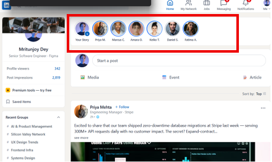
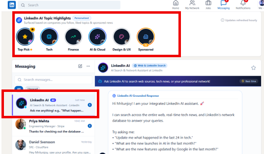
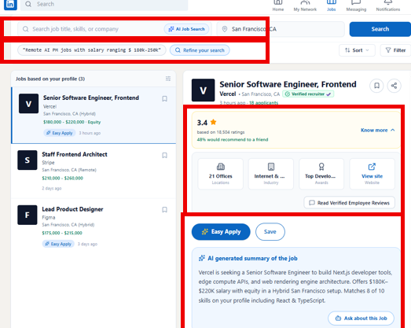

<div align="center">

# LinkedIn AI Suite

**Two AI-native concepts for LinkedIn: a feed worth reading, and a job search worth trusting.**

[](https://react.dev)
[](https://www.typescriptlang.org/)
[](https://vitejs.dev)
[](https://tailwindcss.com)
[](https://ai.google.dev/)
[]()

[**Live Prototype**](https://ai.studio/apps/d262411f-970c-48dc-b535-dad3afdcd472) · [Features](#-features) · [Getting Started](#-getting-started) · [Roadmap](#-roadmap)

</div>

---

## Overview

LinkedIn's feed has become noise, and its jobs product has become a trust problem — ghost listings, unverifiable companies, and search that doesn't understand what you actually want. **LinkedIn AI Suite** is a set of interactive prototypes that fix both, without touching LinkedIn's core feed-ranking algorithm or its recruiter-posting workflow:

- 🧵 **Feed Relevance & Discovery** — turns passive scrolling into active, high-signal catch-up.
- 🛡️ **Job Trust & Search Precision** — turns blind applications into confident ones.

Built as a fully interactive UI prototype in [Google AI Studio](https://ai.studio/), using React, TypeScript, and the Gemini API.

<br>

## ✨ Features

### 1. Status Bubbles — quick network pulse

Instagram-story-style bubbles surface your network's recent activity above the post stream, so you can skim what matters before you scroll.

<p align="center">
  
</p>

### 2. LinkedIn AI Topic Highlights + AI Assistant

Subscribable, AI-curated categories (**Top Pick · Tech · Finance · AI & Cloud · Design & UX**) replace the promotional noise in your feed with real industry signal — organic curation blended with clearly labelled sponsored placements. Can't find what you're after? Ask the **LinkedIn AI Assistant** directly in Messaging: *"What happened in AI in the last 24 hours?"*

<p align="center">
  
</p>

### 3. AI Job Search, Company Trust Score & AI JD Summary

Search by **intent**, not just keywords ("remote AI PM roles, $180–250k"), then refine conversationally. Every listing shows a verified **Company Trust Score**, employee reviews, and structured company facts — plus an **AI-generated summary** of the job description with an "Ask about this job" button for instant follow-up questions.

<p align="center">
  
</p>

<br>

## 🖥️ Live Prototype

Try it here → **[ai.studio/apps/d262411f-970c-48dc-b535-dad3afdcd472](https://ai.studio/apps/d262411f-970c-48dc-b535-dad3afdcd472)**

<br>

## 🛠️ Tech Stack

| Layer | Tech |
|---|---|
| UI | React 19, TypeScript, Tailwind CSS 4 |
| Build tooling | Vite 6 |
| Icons / Motion | lucide-react, motion |
| AI | Google Gemini API (`@google/genai`) |
| Runtime (AI Studio) | Express, dotenv |

> **Note:** the current build renders curated/sample content from `src/mockData.ts` so the UI is fully explorable without an API key. The Gemini wiring (`@google/genai`) is in place for turning Highlights, the AI Assistant, and JD summaries into live, model-generated responses.

<br>

## 🚀 Getting Started

### Prerequisites
- [Node.js](https://nodejs.org/) 18+
- A [Google Gemini API key](https://aistudio.google.com/apikey) (optional — only needed for live AI calls)

### Installation

```bash
# 1. Clone the repo
git clone https://github.com/Mritunjoy-Dey/linkedin-ai-suite.git
cd linkedin-ai-suite

# 2. Install dependencies
npm install

# 3. Set up environment variables
cp .env.example .env
# then open .env and add your own GEMINI_API_KEY

# 4. Run the dev server
npm run dev
```

The app will be running at `http://localhost:3000`.

### Available scripts

| Command | Description |
|---|---|
| `npm run dev` | Start the local dev server |
| `npm run build` | Production build |
| `npm run preview` | Preview the production build locally |
| `npm run lint` | Type-check with `tsc --noEmit` |

<br>

## 📁 Project Structure

```
linkedin-ai-suite/
├── src/
│   ├── components/
│   │   ├── FeedView.tsx              # Home feed + Status Bubbles
│   │   ├── StoryBar.tsx              # Status Bubbles row
│   │   ├── StoryViewerModal.tsx      # Story viewer
│   │   ├── CategoryStoriesBar.tsx    # LinkedIn AI Topic Highlights
│   │   ├── MessagingView.tsx         # LinkedIn AI Assistant
│   │   ├── JobsView.tsx              # AI Job Search + Trust Score + JD summary
│   │   ├── EasyApplyModal.tsx
│   │   ├── NetworkView.tsx
│   │   ├── NotificationsView.tsx
│   │   ├── PostCard.tsx / PostComposer.tsx
│   │   ├── Navbar.tsx / LeftSidebar.tsx / RightSidebar.tsx
│   ├── mockData.ts                   # Sample content for all views
│   ├── types.ts                      # Shared TypeScript types
│   ├── App.tsx
│   └── main.tsx
├── .env.example
├── vite.config.ts
└── package.json
```

<br>

## 🗺️ Roadmap

- [ ] **Real-time Application Status Tracker** — visible pipeline status (Viewed / In review / Rejected) with recruiter SLA nudges
- [ ] **Verified Recruiter badge** — identity-verified recruiters + auto-expiring stale listings
- [ ] Wire Gemini API calls live for Highlights, AI Assistant, and JD summaries (currently sample data)
- [ ] Persist Trust Score & reviews to a real backend

<br>

## 📄 License

No license file yet — this repo is all rights reserved by default until one is added. If you want others to freely use/fork it, add a [`LICENSE`](https://choosealicense.com/) file (MIT is the common pick for prototypes like this).

## 🙋 Author

**Mritunjoy Dey**
[GitHub](https://github.com/Mritunjoy-Dey)

<br>

<div align="center">

*Built with [Google AI Studio](https://ai.studio/)*

</div>
